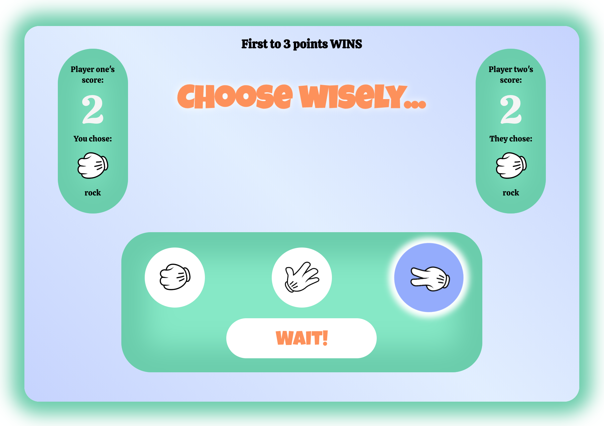

# 🗿📄✂️ Two-player rock-paper-scissors game! ✂️📄🗿

## [-- Click here for the server repository --](https://github.com/ahaigh9877/week-7-game-server)

## Contents

- [Introduction](#markdown-header-introduction)
- [Technologies](#markdown-header-technologies)

## Introduction

For this project pairs of students were asked to produce a full-stack multiplayer game app using a React-Redux front-end with secure signup and login functionality and a back-end with a database for users and streaming technology to keep both players in sync.

## Technologies

### Front-end

- [React](src/components/Game/Game.js)
- [Redux-Thunk](src/actions/users.js)
- [Superagent](src/components/Room.js)

### Back-end

- [Express]()
